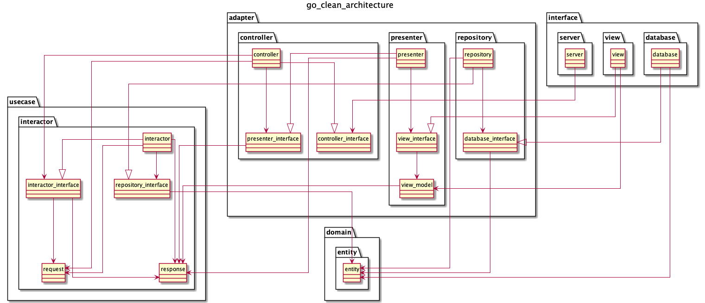

# Clean Architecture by Golang

```
.
├── README.md
├── app
│   ├── controller
│   │   ├── controller.go
│   │   ├── controller_interface.go
│   │   ├── errors.go
│   │   └── presenter_interface.go
│   ├── database
│   │   └── database.go
│   ├── interactor
│   │   ├── entity.go
│   │   ├── interactor.go
│   │   ├── interactor_interface.go
│   │   ├── repository_interface.go
│   │   ├── request.go
│   │   └── response.go
│   ├── presenter
│   │   ├── presenter.go
│   │   ├── view_interface.go
│   │   └── view_model.go
│   ├── repository
│   │   ├── database_interface.go
│   │   └── repository.go
│   ├── server
│   │   └── server.go
│   └── view
│       └── view.go
├── config
│   └── config.yaml
├── docs
│   ├── architecture.png
│   └── architecture.puml
├── fmt.sh
├── go.mod
├── go.sum
└── main.go

10 directories, 26 files

```


